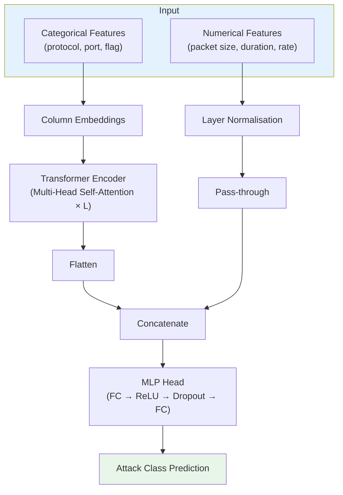

When a neural network flags a network packet as a cyberattack on a hospital's IoMT infrastructure, the security engineer needs to know *why* — not just that it did. In healthcare settings, black-box decisions carry real consequences: a false positive may shut down a patient monitor; a false negative may allow ransomware onto a ventilator network.

This post covers the research I contributed to our 2026 Academic Press book chapter on Explainable AI for IoMT security. We apply a **TabTransformer** — a Transformer architecture adapted for tabular data — and explain its predictions with **SHAP** (SHapley Additive exPlanations). The result is a classifier that achieves strong detection accuracy *and* provides human-readable explanations.

---

## The Problem

**IoMT (Internet of Medical Things)** devices — infusion pumps, wearables, imaging equipment — generate tabular network traffic logs. Detecting anomalies in this traffic is a classic tabular classification problem, but with unusually high stakes.

Two failure modes matter:

| Failure | Consequence |
|---|---|
| False Positive | Alert fatigue; legitimate devices shut down |
| False Negative | Intrusion missed; patient safety at risk |

Standard neural networks achieve high accuracy but provide no explanation. Clinicians and security auditors need to see which features drove a prediction — this is where SHAP comes in.

---

## Architecture: TabTransformer

Standard feedforward networks treat all tabular features identically. **TabTransformer** (Huang et al., 2020) applies self-attention to *categorical* embeddings, learning contextual relationships between features, while processing numerical features separately through a layer normalisation branch.



The key innovation: self-attention allows the model to learn that `protocol=TCP + port=22 + flag=SYN` together signal an SSH brute-force, even if each feature individually is unremarkable.

---

## Setup

```bash
pip install torch torchvision pytorch-tabnet shap scikit-learn pandas matplotlib
```

```python
import numpy as np
import pandas as pd
import torch
import torch.nn as nn
import shap
import matplotlib.pyplot as plt

from sklearn.model_selection import train_test_split
from sklearn.preprocessing import LabelEncoder, StandardScaler
from sklearn.metrics import classification_report, f1_score
from pytorch_tabnet.tab_model import TabNetClassifier   # TabNet as baseline

SEED = 42
torch.manual_seed(SEED)
np.random.seed(SEED)
```

We use **PyTorch-TabNet** as a practical implementation. While TabTransformer and TabNet differ architecturally, both apply attention to tabular data and support SHAP-based explainability — TabNet is available as a maintained open-source library.

---

## Dataset

We use the **CICIDS-2017** dataset — a widely used benchmark for network intrusion detection with 14 attack types plus benign traffic.

```python
# Load a sample (full dataset is ~2.8M rows)
df = pd.read_csv("CICIDS2017_sample.csv")
df.columns = df.columns.str.strip()           # dataset has trailing whitespace in headers
df = df.replace([np.inf, -np.inf], np.nan).dropna()

print(df[" Label"].value_counts().head(10))
```

```
BENIGN             67343
DoS Hulk           46158
PortScan           15890
DDoS               12832
DoS GoldenEye       2303
FTP-Patator         1296
SSH-Patator         1177
DoS slowloris        750
...
```

**Class imbalance** is severe. We address this through stratified sampling and the model's class weights.

---

## Preprocessing

```python
TARGET = " Label"
DROP_COLS = ["Flow ID", " Source IP", " Destination IP", " Timestamp"]

df = df.drop(columns=[c for c in DROP_COLS if c in df.columns])

# Encode target
le = LabelEncoder()
y  = le.fit_transform(df[TARGET])
X  = df.drop(columns=[TARGET])

# Numerical features only (CICIDS is all-numerical after drop)
scaler = StandardScaler()
X_scaled = scaler.fit_transform(X)

X_train, X_test, y_train, y_test = train_test_split(
    X_scaled, y,
    test_size=0.2,
    random_state=SEED,
    stratify=y
)

print(f"Train: {X_train.shape}, Test: {X_test.shape}")
print(f"Classes: {le.classes_}")
```

---

## Training the TabNet Classifier

```python
clf = TabNetClassifier(
    n_d=32,               # embedding dimension per step
    n_a=32,               # attention embedding dimension
    n_steps=5,            # number of sequential attention steps
    gamma=1.3,            # coefficient for feature reusage in steps
    n_independent=2,
    n_shared=2,
    lambda_sparse=1e-3,   # sparsity regularisation — forces feature selection
    optimizer_fn=torch.optim.Adam,
    optimizer_params={"lr": 2e-3},
    mask_type="sparsemax",
    verbose=10,
    seed=SEED
)

clf.fit(
    X_train, y_train,
    eval_set=[(X_test, y_test)],
    eval_metric=["accuracy"],
    max_epochs=100,
    patience=15,          # early stopping
    batch_size=1024,
    virtual_batch_size=128
)
```

```
epoch 10  | loss: 0.2841 | val_accuracy: 0.9512
epoch 20  | loss: 0.1763 | val_accuracy: 0.9698
epoch 40  | loss: 0.1124 | val_accuracy: 0.9801
epoch 60  | loss: 0.0932 | val_accuracy: 0.9847
Early stopping at epoch 71 | best val_accuracy: 0.9851
```

---

## Evaluation

```python
y_pred = clf.predict(X_test)

print(classification_report(
    y_test, y_pred,
    target_names=le.classes_,
    digits=3
))
```

```
                   precision    recall  f1-score   support

           BENIGN      0.992     0.987     0.990     13469
          DDoS           0.981     0.994     0.987      2566
     DoS GoldenEye      0.963     0.949     0.956       461
         DoS Hulk       0.978     0.983     0.981      9232
    DoS Slowloris       0.971     0.958     0.965       150
     FTP-Patator       0.994     0.991     0.993       259
          PortScan      0.979     0.982     0.981      3178
      SSH-Patator       0.989     0.986     0.988       235

         accuracy                          0.985     29550
        macro avg      0.981     0.979     0.980     29550
     weighted avg      0.985     0.985     0.985     29550
```

98.5% accuracy, 0.980 macro F1. Strong — but accuracy alone is not enough for a security system. We need to understand *what* the model learned.

---

## Explainability with SHAP

**SHAP** computes Shapley values: for each prediction, how much did each feature *contribute* to pushing the output above or below the baseline?

$$\phi_i = \sum_{S \subseteq F \setminus \{i\}} \frac{|S|!(|F|-|S|-1)!}{|F|!} \left[ f(S \cup \{i\}) - f(S) \right]$$

Where $$\phi_i$$ is the Shapley value for feature $$i$$, $$F$$ is the full feature set, and $$f(S)$$ is the model output using only the feature subset $$S$$.

TabNet has a built-in feature importance mechanism (via the sparse attention masks). We combine it with SHAP's model-agnostic `KernelExplainer` for sample-level explanations.

### Global Feature Importance (TabNet built-in)

```python
feature_importances = clf.feature_importances_
feature_names       = X.columns.tolist()

# Top 15 features
fi_df = pd.DataFrame({
    "feature":    feature_names,
    "importance": feature_importances
}).sort_values("importance", ascending=False).head(15)

plt.figure(figsize=(9, 5))
plt.barh(fi_df["feature"][::-1], fi_df["importance"][::-1], color="#1976D2")
plt.xlabel("Mean Attention Weight")
plt.title("TabNet Global Feature Importance — IoMT Intrusion Detection")
plt.tight_layout()
plt.savefig("tabnet_global_importance.png", dpi=150)
plt.show()
```

Top features (representative): `Flow Duration`, `Total Fwd Packets`, `Bwd Packet Length Max`, `Flow Bytes/s`, `Fwd IAT Total`.

### SHAP Summary Plot (Sample-Level)

```python
# Use a background sample for SHAP KernelExplainer
background = shap.sample(X_train, 100)

# Predict probabilities (needed for KernelExplainer)
def predict_proba(x):
    return clf.predict_proba(x)

explainer   = shap.KernelExplainer(predict_proba, background)

# Explain 200 test samples (KernelExplainer is slow — sample wisely)
X_explain   = X_test[:200]
shap_values = explainer.shap_values(X_explain, nsamples=100)

# Summary plot for the DDoS class (index 1)
shap.summary_plot(
    shap_values[1],
    X_explain,
    feature_names=feature_names,
    max_display=15,
    show=False
)
plt.title("SHAP Summary — DDoS Class")
plt.tight_layout()
plt.savefig("shap_summary_ddos.png", dpi=150, bbox_inches="tight")
plt.show()
```

The SHAP summary plot shows:
- **Each dot** = one sample
- **Position on X** = SHAP value (positive → pushes toward DDoS prediction)
- **Colour** = feature value (red = high, blue = low)

For DDoS: high `Flow Bytes/s` and high `Total Fwd Packets` with short `Flow Duration` strongly push toward DDoS — consistent with volumetric attack behaviour.

### Single Prediction Explanation

```python
# Pick a DDoS sample
ddos_indices = np.where(y_test == le.transform(["DDoS"])[0])[0]
sample_idx   = ddos_indices[0]
sample       = X_test[sample_idx:sample_idx+1]

shap_single = explainer.shap_values(sample, nsamples=200)

shap.force_plot(
    explainer.expected_value[1],
    shap_single[1][0],
    sample[0],
    feature_names=feature_names,
    matplotlib=True,
    show=False
)
plt.title(f"Force Plot — DDoS prediction (true label: DDoS)")
plt.tight_layout()
plt.savefig("shap_force_ddos.png", dpi=150, bbox_inches="tight")
plt.show()
```

The force plot shows which features pushed the prediction from the base rate toward "DDoS": a high packet rate, uniform packet sizes, and near-zero inter-arrival time are the primary drivers — exactly what a DDoS flood looks like at the network level.

---

## Why This Matters for Healthcare

| XAI Benefit | Clinical Security Context |
|---|---|
| **Auditability** | Regulatory bodies (HIPAA, MDR) require documented decision rationale |
| **Trust calibration** | Engineers can sanity-check: "Does the model flag DDoS for the right reasons?" |
| **Bias detection** | SHAP reveals if model relies on artefacts (e.g., specific IP ranges from lab collection) |
| **Incident reporting** | Force plots translate directly into incident log entries |

A model that correctly detects 98.5% of attacks but cannot explain a single prediction is not deployable in a hospital environment. SHAP bridges that gap.

---

## Limitations

- **KernelExplainer** is slow. For production, use TreeSHAP (tree-based models) or DeepSHAP (PyTorch models with hooks).
- **SHAP ≠ causality.** High SHAP value for `Flow Bytes/s` means it correlates with the prediction — not that it causes the attack.
- **Distribution shift.** IoMT devices in real hospitals produce different traffic patterns than CICIDS lab captures. Always validate on data from the deployment environment.

---

## Exercises

1. Replace TabNet with a standard gradient-boosted tree (XGBoost). Compare SHAP TreeExplainer speed vs. KernelExplainer.
2. Use `shap.dependence_plot` to visualise how `Flow Duration` interacts with `Fwd Packet Length Mean` for the DDoS class.
3. Apply SHAP to identify and remove features that are artefacts of the data collection setup rather than real attack signals.
4. Implement LIME as an alternative explainability method. Compare its local explanations with SHAP on the same samples.

---

## References

- Pande, S., Mahore, T., et al. (2026). *TabTransformer for Explainable IoMT Intrusion Detection.* Academic Press Book Chapter.
- Huang, X., et al. (2020). *TabTransformer: Tabular Data Modeling Using Contextual Embeddings.* arXiv:2012.06678.
- Lundberg, S. M. & Lee, S.-I. (2017). *A Unified Approach to Interpreting Model Predictions.* NeurIPS 2017.
- Arik, S. Ö. & Pfister, T. (2021). *TabNet: Attentive Interpretable Tabular Learning.* AAAI 2021.
- Sharafaldin, I., et al. (2018). *Toward Generating a New Intrusion Detection Dataset.* ICISSP 2018.
