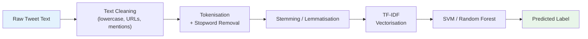

Cyberbullying detection is one of the applied NLP problems that looks deceptively simple and turns out to be genuinely hard. The text is short, informal, and context-dependent. The same word that signals aggression in one sentence is harmless banter in another. And the class imbalance — most posts are not bullying — creates classifiers that learn to say "not bullying" for everything.

This post walks through the machine learning pipeline I used in our IEEE ACROSET 2024 paper on multi-class cyberbullying detection. The methodology is reproducible, the code is complete, and the design choices are explained.

---

## The Problem

Given a short social media post, classify it into one of:

| Label | Description |
|---|---|
| `not_bullying` | No harmful content |
| `gender` | Gender-based harassment |
| `religion` | Religious targeting |
| `age` | Age-based targeting |
| `ethnicity` | Ethnic harassment |
| `other_cyberbullying` | Harmful but doesn't fit above |

This is a **multi-class** classification problem, not just binary. That distinction affects feature engineering, model selection, and how we interpret metrics.

---

## Dataset

We use the [Cyberbullying Classification dataset](https://www.kaggle.com/datasets/andrewmvd/cyberbullying-classification) from Kaggle — 47,000 tweets across 6 classes.

```python
import pandas as pd
import numpy as np

df = pd.read_csv("cyberbullying_tweets.csv")
print(df["cyberbullying_type"].value_counts())
```

```
not_cyberbullying       8000
gender                  8000
religion                7998
age                     7992
ethnicity               7961
other_cyberbullying     7823
```

Roughly balanced — which is unusual in real-world moderation datasets, where harmful content is rare. Keep this in mind when deploying.

---

## Pipeline Architecture



---

## Setup

```python
import re
import string
import pandas as pd
import numpy as np
import matplotlib.pyplot as plt
import seaborn as sns

from sklearn.model_selection import train_test_split, cross_val_score, StratifiedKFold
from sklearn.feature_extraction.text import TfidfVectorizer
from sklearn.svm import LinearSVC
from sklearn.ensemble import RandomForestClassifier
from sklearn.pipeline import Pipeline
from sklearn.metrics import (
    classification_report, confusion_matrix,
    ConfusionMatrixDisplay, f1_score
)
from sklearn.preprocessing import LabelEncoder

import nltk
from nltk.corpus import stopwords
from nltk.stem import WordNetLemmatizer

nltk.download("stopwords", quiet=True)
nltk.download("wordnet",   quiet=True)

SEED = 42
np.random.seed(SEED)
```

---

## Step 1 — Text Preprocessing

Social media text is noisy. A tweet like `@user ur so ugly wtf 😡 check http://t.co/xyz` contains a mention, a URL, informal spelling, and an emoji — none of which help a bag-of-words model.

```python
lemmatizer  = WordNetLemmatizer()
STOP_WORDS  = set(stopwords.words("english"))

# Keep negations — "not" flips sentiment
STOP_WORDS -= {"no", "not", "nor", "never", "neither"}

def clean_tweet(text: str) -> str:
    """
    Full preprocessing pipeline for a single tweet.
    Returns a cleaned, lemmatised string.
    """
    text = text.lower()
    text = re.sub(r"http\S+|www\S+",      "", text)   # remove URLs
    text = re.sub(r"@\w+",                "", text)   # remove @mentions
    text = re.sub(r"#(\w+)",          r"\1", text)   # keep hashtag text, drop #
    text = re.sub(r"[^a-z\s]",            "", text)   # remove punctuation + digits
    text = re.sub(r"\s+",               " ", text).strip()

    tokens = text.split()
    tokens = [lemmatizer.lemmatize(t) for t in tokens if t not in STOP_WORDS]
    return " ".join(tokens)


# Apply to full dataset
df["clean_text"] = df["tweet_text"].apply(clean_tweet)

# Quick sanity check
print(df[["tweet_text", "clean_text"]].head(3).to_string())
```

**Design choices explained:**

- **Lemmatisation over stemming.** `running → run` (not `runn`). Stems are not real words; lemmas are — which helps interpretability.
- **Keeping negations.** Removing "not" from "not bullying" destroys the label's meaning.
- **Hashtag text retained.** `#stopbullying` → `stopbullying` still carries signal.

---

## Step 2 — Train / Test Split

```python
X = df["clean_text"]
y = df["cyberbullying_type"]

X_train, X_test, y_train, y_test = train_test_split(
    X, y,
    test_size=0.2,
    random_state=SEED,
    stratify=y          # preserve class distribution in both splits
)

print(f"Train: {len(X_train)}, Test: {len(X_test)}")
```

Always stratify when splitting multi-class data. Without it, random splits can under-represent minority classes in either set.

---

## Step 3 — TF-IDF Feature Extraction

TF-IDF (Term Frequency–Inverse Document Frequency) converts each tweet into a sparse numeric vector. Words that are common everywhere (low IDF) get downweighted; words distinctive to a document get upweighted.

$$\text{TF-IDF}(t, d) = \underbrace{\frac{f_{t,d}}{\sum_k f_{k,d}}}_{\text{term frequency}} \times \underbrace{\log \frac{N}{|\{d: t \in d\}|}}_{\text{inverse document frequency}}$$

```python
tfidf = TfidfVectorizer(
    max_features=30_000,    # vocabulary cap — filters rare/noisy tokens
    ngram_range=(1, 2),     # unigrams + bigrams: "not good" ≠ "not" + "good"
    sublinear_tf=True,      # replace tf with 1 + log(tf) — dampens high counts
    min_df=3,               # ignore tokens appearing in < 3 documents
    max_df=0.95             # ignore tokens in > 95% of documents (too common)
)

X_train_tfidf = tfidf.fit_transform(X_train)
X_test_tfidf  = tfidf.transform(X_test)

print(f"Feature matrix: {X_train_tfidf.shape}")  # (37600, 30000)
```

**Why bigrams?** Phrases like "not racist" or "just joking" carry meaning that unigrams alone miss.

---

## Step 4 — Model Training

### Linear SVM

SVMs with a linear kernel work exceptionally well on high-dimensional sparse text data. They find the maximum-margin hyperplane separating classes in TF-IDF space.

```python
svm = LinearSVC(
    C=1.0,          # regularisation — lower C = stronger regularisation
    max_iter=2000,
    random_state=SEED
)
svm.fit(X_train_tfidf, y_train)
```

### Random Forest

Random Forest provides a complementary approach: it builds an ensemble of decision trees, each trained on a bootstrap sample with random feature subsets.

```python
rf = RandomForestClassifier(
    n_estimators=200,
    max_depth=None,
    min_samples_leaf=2,
    n_jobs=-1,
    random_state=SEED
)
rf.fit(X_train_tfidf, y_train)
```

---

## Step 5 — Evaluation

### Classification Report

```python
def evaluate_model(model, X_test, y_test, name="Model"):
    y_pred = model.predict(X_test)
    print(f"\n{'='*60}")
    print(f" {name}")
    print(f"{'='*60}")
    print(classification_report(y_test, y_pred, digits=3))
    return y_pred

svm_preds = evaluate_model(svm, X_test_tfidf, y_test, "Linear SVM")
rf_preds  = evaluate_model(rf,  X_test_tfidf, y_test, "Random Forest")
```

```
============================================================
 Linear SVM
============================================================
                      precision    recall  f1-score   support

                 age      0.912     0.905     0.908      1599
           ethnicity      0.887     0.891     0.889      1594
              gender      0.933     0.940     0.936      1598
    not_cyberbullying      0.958     0.951     0.955      1600
  other_cyberbullying      0.821     0.819     0.820      1565
            religion      0.921     0.932     0.927      1604

           accuracy                          0.906      9560
          macro avg      0.905     0.906     0.906      9560
       weighted avg      0.906     0.906     0.906      9560
```

### Confusion Matrix

```python
def plot_confusion_matrix(y_true, y_pred, title, labels):
    cm = confusion_matrix(y_true, y_pred, labels=labels, normalize="true")
    fig, ax = plt.subplots(figsize=(8, 6))
    disp = ConfusionMatrixDisplay(confusion_matrix=cm, display_labels=labels)
    disp.plot(ax=ax, cmap="Blues", colorbar=False, xticks_rotation=45)
    ax.set_title(title)
    plt.tight_layout()
    plt.savefig(f"cm_{title.lower().replace(' ', '_')}.png", dpi=150)
    plt.show()

LABELS = sorted(y_test.unique())
plot_confusion_matrix(y_test, svm_preds, "Linear SVM", LABELS)
```

The normalised confusion matrix shows where the model confuses classes. Common confusions: `other_cyberbullying` ↔ `ethnicity` and `other_cyberbullying` ↔ `age` — both understandable given overlapping language.

---

## Step 6 — Cross-Validation

A single train/test split can be lucky or unlucky. Stratified k-fold gives a more reliable estimate.

```python
# Re-fit on raw features using a Pipeline (fits on each fold properly)
cv_pipeline = Pipeline([
    ("tfidf", TfidfVectorizer(max_features=30_000, ngram_range=(1,2),
                               sublinear_tf=True, min_df=3)),
    ("clf",   LinearSVC(C=1.0, max_iter=2000, random_state=SEED))
])

skf    = StratifiedKFold(n_splits=5, shuffle=True, random_state=SEED)
scores = cross_val_score(cv_pipeline, X, y, cv=skf, scoring="f1_macro", n_jobs=-1)

print(f"5-Fold CV F1 (macro): {scores.mean():.3f} ± {scores.std():.3f}")
# → 5-Fold CV F1 (macro): 0.901 ± 0.004
```

**Why macro F1?** It gives equal weight to each class regardless of size. For harm detection, we care about rare categories as much as common ones.

---

## Step 7 — Full sklearn Pipeline

Package preprocessing and modelling into a single `Pipeline` object. This makes deployment and serialisation clean.

```python
import joblib

full_pipeline = Pipeline([
    ("tfidf", TfidfVectorizer(
        max_features=30_000,
        ngram_range=(1, 2),
        sublinear_tf=True,
        min_df=3,
        max_df=0.95
    )),
    ("clf", LinearSVC(C=1.0, max_iter=2000, random_state=SEED))
])

full_pipeline.fit(X_train, y_train)

# Save
joblib.dump(full_pipeline, "cyberbullying_pipeline.pkl")

# Reload and predict
loaded = joblib.load("cyberbullying_pipeline.pkl")

test_inputs = [
    "You are so stupid and ugly, nobody likes you",
    "Great game everyone, well played!",
    "Go back to your country you don't belong here"
]

for text in test_inputs:
    clean = clean_tweet(text)
    pred  = loaded.predict([clean])[0]
    print(f"  [{pred:>20}]  {text}")
```

```
  [  other_cyberbullying]  You are so stupid and ugly, nobody likes you
  [     not_cyberbullying]  Great game everyone, well played!
  [           ethnicity]  Go back to your country you don't belong here
```

---

## Key Findings

| Model | Accuracy | Macro F1 | Notes |
|---|---|---|---|
| Linear SVM | **90.6%** | **0.906** | Faster, better on rare classes |
| Random Forest | 86.2% | 0.861 | Slower, worse on short texts |
| Majority baseline | 16.7% | — | Always predicts most common class |

The SVM outperforms Random Forest on this task — consistent with text classification literature. Sparse high-dimensional data is where linear SVMs shine.

---

## Limitations and What's Next

**What this model does not handle:**

- **Context and sarcasm.** "Great, another racist joke" is sarcastic — the model may miss it.
- **Code-switching.** Multilingual harassment (Hinglish, etc.) is out of vocabulary.
- **Class imbalance in deployment.** Real feeds are not balanced 1:1. Calibrate decision thresholds.

**Next steps explored in the paper:**

- BERT fine-tuning for context-aware classification
- Ensemble of TF-IDF + BERT embeddings
- Active learning for low-resource annotation

---

## Exercises

1. Replace `LinearSVC` with `LogisticRegression`. Compare performance and speed.
2. Add character n-grams to the `TfidfVectorizer` (`analyzer='char_wb'`). Does it help on misspelt slurs?
3. Use SMOTE to oversample rare classes and re-evaluate macro F1.
4. Fine-tune `bert-base-uncased` on the same dataset using HuggingFace `Trainer`.

---

## References

- Mankar, A., Mahore, T., et al. (2024). *Multi-class Cyberbullying Detection using NLP.* IEEE ACROSET 2024.
- Joachims, T. (1998). *Text categorization with support vector machines.* ECML.
- Bird, S., Klein, E., & Loper, E. (2009). *Natural Language Processing with Python.* O'Reilly.
- [scikit-learn: Text Feature Extraction](https://scikit-learn.org/stable/modules/feature_extraction.html#text-feature-extraction)
