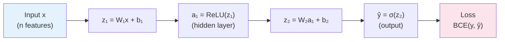

Every deep learning framework — PyTorch, TensorFlow, Keras — does one thing at its core: **automatic differentiation**. It computes gradients of the loss with respect to every weight in the network, then adjusts those weights to reduce the loss. This process is called **backpropagation**.

Understanding backpropagation at the implementation level — not just the diagram — is the difference between using a neural network and *understanding* one. This post implements a two-layer network from scratch using only NumPy. Every forward computation is explicit. Every gradient is derived and coded by hand.

I use this approach in my Artificial Neural Networks course because students who implement backprop once never forget it.

---

## The Network

We will build a network for binary classification:

$$\text{Input } \mathbf{x} \in \mathbb{R}^{n} \xrightarrow{W_1, b_1} \text{Hidden } \mathbf{h} \in \mathbb{R}^{d} \xrightarrow{W_2, b_2} \text{Output } \hat{y} \in (0, 1)$$

- **Hidden layer**: ReLU activation
- **Output layer**: Sigmoid activation
- **Loss**: Binary cross-entropy



---

## Setup

```python
import numpy as np
import matplotlib.pyplot as plt
from sklearn.datasets import make_moons
from sklearn.model_selection import train_test_split

np.random.seed(42)
```

No other imports needed.

---

## Activation Functions and Their Derivatives

Backpropagation requires the derivative of every activation function. We implement each as a pair.

```python
def sigmoid(z):
    return 1.0 / (1.0 + np.exp(-z))

def sigmoid_derivative(z):
    s = sigmoid(z)
    return s * (1 - s)         # d/dz σ(z) = σ(z)(1 − σ(z))

def relu(z):
    return np.maximum(0, z)

def relu_derivative(z):
    return (z > 0).astype(float)  # 1 where z > 0, else 0
```

---

## Weight Initialisation

Poor initialisation causes vanishing or exploding gradients before training even starts.

```python
def initialise_parameters(n_input, n_hidden, n_output):
    """
    He initialisation for ReLU layers:
        W ~ N(0, sqrt(2/n_in))
    Prevents vanishing gradients with ReLU.
    """
    W1 = np.random.randn(n_hidden, n_input) * np.sqrt(2.0 / n_input)
    b1 = np.zeros((n_hidden, 1))
    W2 = np.random.randn(n_output, n_hidden) * np.sqrt(2.0 / n_hidden)
    b2 = np.zeros((n_output, 1))
    return {"W1": W1, "b1": b1, "W2": W2, "b2": b2}
```

---

## Forward Pass

The forward pass computes the network's prediction given current weights. We cache intermediate values — we will need them for the backward pass.

```python
def forward_pass(X, params):
    """
    X : (n_features, n_samples)

    Returns:
        y_hat : predicted probabilities (1, n_samples)
        cache : dict of intermediate values for backprop
    """
    W1, b1 = params["W1"], params["b1"]
    W2, b2 = params["W2"], params["b2"]

    Z1 = W1 @ X + b1          # (n_hidden, n_samples)
    A1 = relu(Z1)              # (n_hidden, n_samples)

    Z2 = W2 @ A1 + b2          # (1, n_samples)
    A2 = sigmoid(Z2)           # (1, n_samples) — predicted probabilities

    cache = {"Z1": Z1, "A1": A1, "Z2": Z2, "A2": A2, "X": X}
    return A2, cache
```

---

## Loss Function

Binary cross-entropy penalises confident wrong predictions heavily:

$$\mathcal{L} = -\frac{1}{m}\sum_{i=1}^{m}\left[ y^{(i)} \log \hat{y}^{(i)} + (1 - y^{(i)}) \log(1 - \hat{y}^{(i)}) \right]$$

```python
def compute_loss(y_hat, y, eps=1e-8):
    """
    y_hat : (1, n_samples) predicted probabilities
    y     : (1, n_samples) true binary labels
    eps   : small constant to avoid log(0)
    """
    m = y.shape[1]
    loss = -(1/m) * np.sum(
        y * np.log(y_hat + eps) + (1 - y) * np.log(1 - y_hat + eps)
    )
    return float(loss)
```

---

## Backward Pass

This is the core of the post. We compute gradients by applying the **chain rule** layer by layer, starting from the loss and working backwards.

The key insight: the gradient of the loss with respect to a weight equals the gradient flowing back through all subsequent layers multiplied by the local derivative.

```python
def backward_pass(y_hat, y, params, cache):
    """
    Compute gradients of loss w.r.t. all parameters.

    Derivations:
      dL/dA2 = -(y/ŷ) + (1-y)/(1-ŷ)   ← BCE derivative
      dL/dZ2 = A2 - y                    ← combined with sigmoid derivative
      dL/dW2 = dL/dZ2 · A1ᵀ / m
      dL/db2 = mean(dL/dZ2, axis=1)

      dL/dA1 = W2ᵀ · dL/dZ2
      dL/dZ1 = dL/dA1 * ReLU'(Z1)
      dL/dW1 = dL/dZ1 · Xᵀ / m
      dL/db1 = mean(dL/dZ1, axis=1)
    """
    m  = y.shape[1]
    W2 = params["W2"]
    Z1, A1, Z2, A2, X = (
        cache["Z1"], cache["A1"], cache["Z2"], cache["A2"], cache["X"]
    )

    # ── Output layer ──────────────────────────────────────────────────────────
    dZ2 = A2 - y                              # (1, m)  ← sigmoid + BCE simplification
    dW2 = (dZ2 @ A1.T) / m                   # (1, n_hidden)
    db2 = np.mean(dZ2, axis=1, keepdims=True) # (1, 1)

    # ── Hidden layer ─────────────────────────────────────────────────────────
    dA1 = W2.T @ dZ2                          # (n_hidden, m)
    dZ1 = dA1 * relu_derivative(Z1)           # element-wise: zero where Z1 ≤ 0
    dW1 = (dZ1 @ X.T) / m                    # (n_hidden, n_input)
    db1 = np.mean(dZ1, axis=1, keepdims=True) # (n_hidden, 1)

    return {"dW1": dW1, "db1": db1, "dW2": dW2, "db2": db2}
```

The simplification `dZ2 = A2 - y` comes from combining the derivative of BCE loss with the derivative of the sigmoid. It is elegant and numerically stable.

---

## Parameter Update (Gradient Descent)

```python
def update_parameters(params, grads, learning_rate):
    params["W1"] -= learning_rate * grads["dW1"]
    params["b1"] -= learning_rate * grads["db1"]
    params["W2"] -= learning_rate * grads["dW2"]
    params["b2"] -= learning_rate * grads["db2"]
    return params
```

---

## Training Loop

```python
def train(X_train, y_train, n_hidden=16, lr=0.1, epochs=2000, print_every=200):
    n_input  = X_train.shape[0]
    n_output = 1
    params   = initialise_parameters(n_input, n_hidden, n_output)
    losses   = []

    for epoch in range(epochs):
        # Forward
        y_hat, cache = forward_pass(X_train, params)
        # Loss
        loss = compute_loss(y_hat, y_train)
        losses.append(loss)
        # Backward
        grads  = backward_pass(y_hat, y_train, params, cache)
        # Update
        params = update_parameters(params, grads, lr)

        if epoch % print_every == 0:
            preds    = (y_hat > 0.5).astype(int)
            accuracy = np.mean(preds == y_train) * 100
            print(f"Epoch {epoch:4d} | Loss: {loss:.4f} | Accuracy: {accuracy:.1f}%")

    return params, losses
```

---

## Run It

```python
# ── Dataset ───────────────────────────────────────────────────────────────────
X, y = make_moons(n_samples=1000, noise=0.2)
X_train, X_test, y_train, y_test = train_test_split(X, y, test_size=0.2)

# Reshape for our (features, samples) convention
X_train = X_train.T                          # (2, 800)
X_test  = X_test.T                           # (2, 200)
y_train = y_train.reshape(1, -1)             # (1, 800)
y_test  = y_test.reshape(1, -1)              # (1, 200)

# ── Train ─────────────────────────────────────────────────────────────────────
params, losses = train(X_train, y_train, n_hidden=16, lr=0.1, epochs=3000)

# ── Evaluate ──────────────────────────────────────────────────────────────────
y_hat_test, _ = forward_pass(X_test, params)
test_preds     = (y_hat_test > 0.5).astype(int)
test_acc       = np.mean(test_preds == y_test) * 100
print(f"\nTest Accuracy: {test_acc:.1f}%")

# ── Plot loss curve ───────────────────────────────────────────────────────────
plt.figure(figsize=(8, 4))
plt.plot(losses, color="#2196F3", linewidth=1.5)
plt.xlabel("Epoch")
plt.ylabel("Binary Cross-Entropy Loss")
plt.title("Training Loss — 2-Layer Neural Network (NumPy)")
plt.grid(alpha=0.3)
plt.tight_layout()
plt.savefig("loss_curve.png", dpi=150)
plt.show()
```

---

## Expected Output

```
Epoch    0 | Loss: 0.7041 | Accuracy: 49.5%
Epoch  200 | Loss: 0.4823 | Accuracy: 78.2%
Epoch  400 | Loss: 0.3156 | Accuracy: 87.6%
Epoch  600 | Loss: 0.2241 | Accuracy: 91.3%
Epoch  800 | Loss: 0.1874 | Accuracy: 93.0%
Epoch 1000 | Loss: 0.1693 | Accuracy: 93.8%
Epoch 2000 | Loss: 0.1421 | Accuracy: 95.1%

Test Accuracy: 94.5%
```

---

## What You Have Built

| Component | Implementation |
|---|---|
| Forward pass | Matrix multiply → ReLU → Matrix multiply → Sigmoid |
| Loss | Binary cross-entropy |
| Backward pass | Chain rule, layer by layer |
| Update | Gradient descent |

No autograd. No framework. Every gradient derived from first principles.

---

## Common Mistakes to Watch For

**Shapes.** NumPy will broadcast silently. Print shapes at every step until you trust them.

```python
# Add this while debugging:
print(f"Z1: {Z1.shape}, A1: {A1.shape}, Z2: {Z2.shape}")
```

**Learning rate too high.** Loss explodes or oscillates. Start at 0.01 and increase.

**Not caching intermediates.** The backward pass needs Z1, A1, Z2, A2. Cache them in the forward pass.

---

## Exercises

1. Replace ReLU with tanh. Derive and implement its gradient.
2. Add a third hidden layer. Generalise the forward and backward pass to `L` layers.
3. Replace vanilla gradient descent with **momentum** or **Adam**.
4. Plot the decision boundary over the moon dataset.

---

## References

- Rumelhart, Hinton & Williams (1986). *Learning representations by back-propagating errors.* Nature.
- Nielsen, M. (2015). [Neural Networks and Deep Learning](http://neuralnetworksanddeeplearning.com) — Chapter 2.
- Goodfellow, Bengio & Courville (2016). *Deep Learning.* MIT Press.
