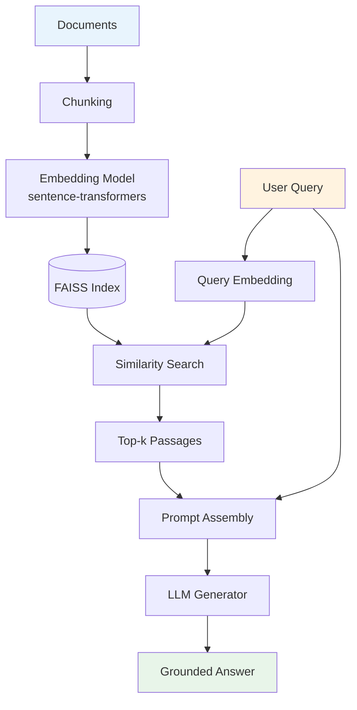

Large Language Models are impressive — until they hallucinate a citation that doesn't exist, or confidently answer a question about events after their training cutoff. **Retrieval-Augmented Generation (RAG)** is the architectural fix: instead of relying purely on parametric memory baked into model weights, we retrieve relevant documents at inference time and ground the response in them.

This post walks through building a minimal but complete RAG pipeline from scratch. No LangChain magic — just the moving parts, visible.

---

## What We Are Building

A system that:
1. Ingests a set of documents and indexes them by semantic meaning
2. Takes a user query, finds the most relevant passages
3. Sends the query + retrieved passages to an LLM to generate a grounded answer



---

## Setup

```bash
pip install sentence-transformers faiss-cpu transformers torch
```

For this walkthrough we use:
- **sentence-transformers** — embedding documents and queries
- **FAISS** — approximate nearest-neighbour index
- **transformers** — local LLM for generation (or swap in an API)

---

## Step 1 — Document Loading and Chunking

RAG works on chunks, not full documents. A 10-page PDF fed as one string drowns the model in irrelevant context. We split into overlapping chunks so no information is cut off at a boundary.

```python
from typing import List

def load_documents(paths: List[str]) -> List[str]:
    """Load plain-text documents from file paths."""
    docs = []
    for path in paths:
        with open(path, "r", encoding="utf-8") as f:
            docs.append(f.read())
    return docs


def chunk_text(text: str, chunk_size: int = 300, overlap: int = 50) -> List[str]:
    """Split text into overlapping word-level chunks."""
    words = text.split()
    chunks = []
    start = 0
    while start < len(words):
        end = start + chunk_size
        chunk = " ".join(words[start:end])
        chunks.append(chunk)
        start += chunk_size - overlap  # slide with overlap
    return chunks


def build_corpus(paths: List[str]) -> List[str]:
    docs = load_documents(paths)
    corpus = []
    for doc in docs:
        corpus.extend(chunk_text(doc))
    return corpus
```

**Why overlap?** A key sentence might sit at the boundary between two chunks. An overlap of ~50 words ensures it appears fully in at least one chunk.

---

## Step 2 — Embedding the Corpus

We use a bi-encoder — a model that maps any text to a fixed-size dense vector such that semantically similar texts land close together in vector space.

```python
from sentence_transformers import SentenceTransformer
import numpy as np

EMBED_MODEL = "sentence-transformers/all-MiniLM-L6-v2"

def embed_corpus(corpus: List[str], model_name: str = EMBED_MODEL) -> np.ndarray:
    """
    Encode all corpus chunks into dense vectors.
    Returns array of shape (n_chunks, embedding_dim).
    """
    model = SentenceTransformer(model_name)
    print(f"Embedding {len(corpus)} chunks...")
    embeddings = model.encode(
        corpus,
        batch_size=64,
        show_progress_bar=True,
        normalize_embeddings=True  # L2-normalise for cosine similarity via dot product
    )
    return embeddings
```

`all-MiniLM-L6-v2` is 22M parameters — fast and accurate enough for most use cases. For higher accuracy, swap in `BAAI/bge-large-en-v1.5`.

---

## Step 3 — Building the FAISS Index

FAISS (Facebook AI Similarity Search) lets us search millions of vectors in milliseconds using approximate nearest-neighbour algorithms.

```python
import faiss

def build_index(embeddings: np.ndarray) -> faiss.IndexFlatIP:
    """
    Build a flat inner-product FAISS index.
    With L2-normalised vectors, inner product == cosine similarity.
    """
    dim = embeddings.shape[1]
    index = faiss.IndexFlatIP(dim)
    index.add(embeddings.astype(np.float32))
    print(f"Index built: {index.ntotal} vectors, dim={dim}")
    return index


def save_index(index: faiss.Index, path: str):
    faiss.write_index(index, path)

def load_index(path: str) -> faiss.Index:
    return faiss.read_index(path)
```

For large corpora (>100k chunks), replace `IndexFlatIP` with `IndexIVFFlat` or `IndexHNSWFlat` for faster (approximate) search.

---

## Step 4 — Retrieval

Given a user query, embed it and find the top-k most similar chunks.

```python
def retrieve(
    query: str,
    index: faiss.Index,
    corpus: List[str],
    model_name: str = EMBED_MODEL,
    top_k: int = 5
) -> List[str]:
    """
    Embed query, search FAISS index, return top-k text chunks.
    """
    model = SentenceTransformer(model_name)
    query_vec = model.encode(
        [query],
        normalize_embeddings=True
    ).astype(np.float32)

    scores, indices = index.search(query_vec, top_k)

    results = []
    for score, idx in zip(scores[0], indices[0]):
        results.append({
            "text": corpus[idx],
            "score": float(score)
        })
    return results
```

---

## Step 5 — Prompt Assembly and Generation

Retrieved chunks are injected into the prompt as context. The LLM is instructed to answer only from the provided context — the key constraint that reduces hallucination.

```python
from transformers import pipeline

def build_prompt(query: str, context_chunks: List[dict]) -> str:
    context = "\n\n---\n\n".join(
        [f"[Passage {i+1}]\n{c['text']}" for i, c in enumerate(context_chunks)]
    )
    prompt = f"""You are a helpful assistant. Answer the question using ONLY the provided context.
If the answer is not in the context, say "I don't have enough information to answer this."

Context:
{context}

Question: {query}

Answer:"""
    return prompt


def generate_answer(prompt: str, model_name: str = "google/flan-t5-base") -> str:
    """
    Generate an answer using a local seq2seq model.
    Swap model_name for any HuggingFace-compatible model.
    """
    generator = pipeline("text2text-generation", model=model_name)
    output = generator(
        prompt,
        max_new_tokens=256,
        do_sample=False
    )
    return output[0]["generated_text"]
```

---

## Step 6 — Putting It All Together

```python
import os

# ── Config ──────────────────────────────────────────────────────────────────
DOCS_DIR    = "./documents"
INDEX_PATH  = "./rag_index.faiss"
CORPUS_PATH = "./corpus.txt"

# ── Build (run once) ─────────────────────────────────────────────────────────
doc_paths = [
    os.path.join(DOCS_DIR, f)
    for f in os.listdir(DOCS_DIR) if f.endswith(".txt")
]
corpus    = build_corpus(doc_paths)
embeddings = embed_corpus(corpus)
index     = build_index(embeddings)
save_index(index, INDEX_PATH)

# Save corpus for retrieval lookups
with open(CORPUS_PATH, "w") as f:
    for chunk in corpus:
        f.write(chunk + "\n<<<CHUNK_SEP>>>\n")

# ── Query (run anytime) ───────────────────────────────────────────────────────
index  = load_index(INDEX_PATH)
with open(CORPUS_PATH) as f:
    corpus = f.read().split("\n<<<CHUNK_SEP>>>\n")

query  = "What are the main challenges in retrieval-augmented generation?"
chunks = retrieve(query, index, corpus, top_k=4)
prompt = build_prompt(query, chunks)
answer = generate_answer(prompt)

print(f"\nQuery : {query}")
print(f"Answer: {answer}")
print("\nSources:")
for i, c in enumerate(chunks):
    print(f"  [{i+1}] score={c['score']:.3f} | {c['text'][:80]}...")
```

---

## Sample Output

```
Embedding 142 chunks: 100%|████████████████| 3/3 [00:02<00:00]
Index built: 142 vectors, dim=384

Query : What are the main challenges in retrieval-augmented generation?
Answer: The main challenges include retrieval-generation mismatch, multi-hop
        reasoning over multiple documents, managing long contexts, and
        hallucination even when relevant passages are retrieved.

Sources:
  [1] score=0.872 | The core difficulty in RAG is ensuring the generator
                    actually uses the retrieved passages...
  [2] score=0.841 | Multi-hop questions require reasoning over chains of
                    documents, which flat retrieval struggles with...
```

---

## Where to Go From Here

| Enhancement | What it gives you |
|---|---|
| **HyDE** — generate a hypothetical answer, embed it | Better retrieval for complex queries |
| **Re-ranking** with a cross-encoder | Higher precision top-k results |
| **Hybrid search** (BM25 + dense) | Handles keyword-heavy queries better |
| **Self-RAG** — LLM decides when to retrieve | Avoids retrieval on questions it already knows |
| **CTranslate2 / llama.cpp** for generation | Edge-deployable offline inference |

The last row is what my PhD research focuses on — building the full pipeline for offline disaster response, where cloud access is unavailable. A future post will cover that in detail.

---

## References

- Lewis et al. (2020). *Retrieval-Augmented Generation for Knowledge-Intensive NLP Tasks.* NeurIPS 2020.
- Gao et al. (2023). *RAG for Large Language Models: A Survey.* arXiv:2312.10997.
- [FAISS documentation](https://faiss.ai)
- [sentence-transformers](https://www.sbert.net)
